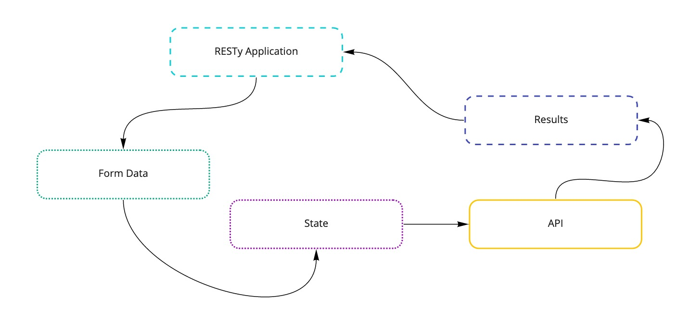

# Lab 26 - 401 JavaScript

## RESTy-API

### Author: Jason Taisey

### Links and Resources

[Github](https://github.com/JTaisey389/RESTy-API)
[Pull-Requests](https://github.com/JTaisey389/RESTy-API/pulls?q=is%3Apr+is%3Aclosed)

### User Stories

The following user/developer stories detail the major functionality for this phase of the project.

- As a user, I expect an easy to read and understand user interface so that I can use the application intuitively
- As a user, I want to enter the URL to a REST API and select the REST method to use to access it
- As a user, I want visual confirmation that my entries and selections are valid so that I have confidence the application will be able to fetch the API data that I’ve requested
- And as developers, here are the high level development tasks that address the above end user requirements

- Create a visually appealing site with a Header, Footer, and a large content area
- Create a form that asks for a URL
- Create buttons that let the user choose from the REST methods (get, post, put, delete)
- When the form is filled out, and the button is clicked, display the URL and the method chosen

- Day Two User Stories:

The following user stories detail the major functionality for this phase of the project.

- As a user, I want to enter the URL to an API and issue a GET request so that I can retrieve it’s data
- As a user, I want to see the results returned from an API request in my browser in a readable format

- Day Three User Stories:

- As a user, I want to be able to use all REST methods so that I can do more than just get data
- As a user, I want a simple list of all previous queries I’ve run so that I can easily see which queries I’ve run before
- As a user, I want to click on an old query and have my selections appear in the form for me, so I don’t have to re-type them
- As a user, I want to see a “loading” indicator while RESTy is fetching data so that I know it’s working on my request

### Application Flow

1. User enters an API URL
2. Chooses a REST Method
2. Clicks the “Go” button
3. Application fetches data from the URL given, with the method specified
4. Displays the response headers and results separately
5. Both headers and results should be “pretty printed” JSON

### Technical Requirements

Update the RESTy application as follows:

- Add support for PUT, POST, and DELETE in your remote calls
- Whenever a query is successful (results come back), store the query parameters in local storage
- Store the URL, Method, and the Body (if any)
- Store only unique, successful queries

- Home Page

  - Add a simple history list to the left side of the application
    - List all previous queries, showing the method and the URL
    - When a user clicks a previous query, populate the RESTy forms with the query information
- Completely hide the output area (Headers & Results) when there are none to display
- Display any fetch/load errors in place of the results area, if they occur
- Add a “Loading” indicator while fetching
  - When the user clicks the “Go!” button, show a loading icon on the page
  - When the fetching of results is complete, remove the loading icon and show the results

### UML

### Deployed Application

- <https://60ad966e7fdb0300d424503d--blissful-ptolemy-980c35.netlify.app/>
